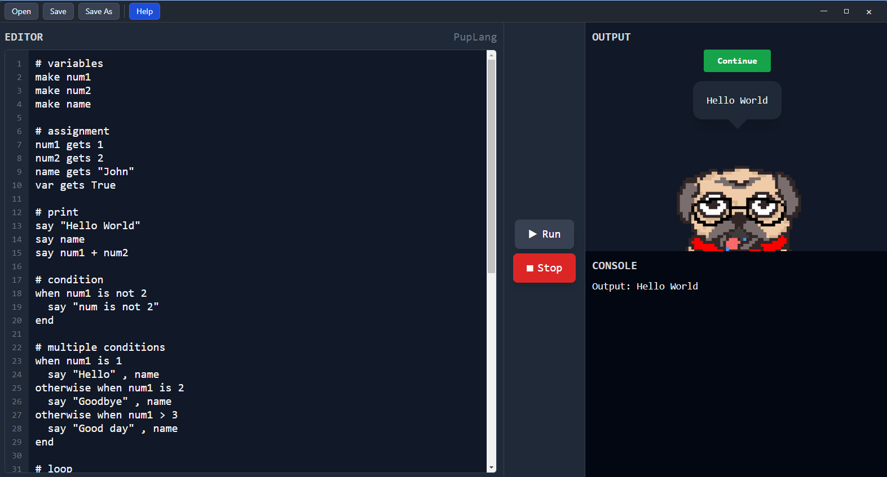

# PupLang - IDE & Runtime

A modern, beginner-friendly programming language with a sleek Electron-based IDE. PupLang combines intuitive syntax with powerful features to make learning programming enjoyable and accessible.

## 🌟 Features

- **Intuitive Syntax** - English-like commands that are easy to learn and read
- **Interactive IDE** - Built-in editor with live execution and real-time output
- **Variable Management** - Simple variable declaration and assignment
- **Control Flow** - Conditional statements and loops
- **Functions** - Define and call reusable functions
- **User Input** - Interactive input for numbers and strings
- **Console Output** - Real-time output display and logging

## 🚀 Getting Started

### Prerequisites
- Node.js (v16 or higher)
- Bun (for dependency management and scripts)
- Python (3.9 or higher)

### File Format

PupLang programs use the `.pup` file extension.

## 📚 Examples

See the `runtime-environment/interpreter/examples/` directory for example programs:

- `calculator_demo.pup` - Basic arithmetic demonstration
- `calculator_interactive.pup` - Interactive calculator with user input

## 🤝 Contributing

Contributions are welcome! Please feel free to submit a Pull Request.

## 📧 Support

For questions or issues, please open an issue on GitHub.

---

**Happy coding! 🎉**

Visit the Help button in the IDE for detailed language syntax and examples.